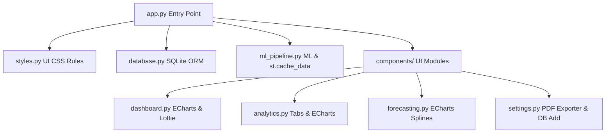

# 🔮 Predictive Finance Engine

An intelligent, visually stunning financial analytics and predictive forecasting platform. Built using **Streamlit**, **Apache ECharts**, **SQLAlchemy**, and **Scikit-Learn** estimators to provide real-time budget forecasting, diagnostic analytics, and AI financial advice.

---

## 🚀 Key Features

### 1. 📈 Machine Learning Projections & Horizon Alerts
- Trains **Random Forest Regressors** and **Linear Regression** estimators dynamically on your spending patterns.
- Forecasts outflow trends across configurable horizons (15 to 90 days) on Daily, Weekly, or Monthly scales.
- Computes **15-Day Budget Breach Warnings** by overlaying current-month spending with predictive forecasts to notify you before ceilings are crossed.

### 2. 💎 Premium Glassmorphic UI & Styling
- Curated dark cosmic design system with smooth lift-up hover scales (`translateY(-4px)`), thin custom scrollbars, and glowing colored card borders.
- Replaced standard metric widgets with custom HTML templates containing **glowing red/green SVG delta pills** representing spending fluctuations.
- Native sidebar navigation styled into interactive navigator pills with neon hover indicators.

### 3. 📊 Apache ECharts & Tabbed Layouts
- Replaced basic charts with highly interactive **Apache ECharts** (`streamlit-echarts`), incorporating glowing splines (`shadowBlur`), gradient color fills, and hover focus states.
- Clean tabbed routing using `st.tabs` on the Analytics view to segregate:
  - `[ Category Breakdown ]`: Account spend and statistic tables.
  - `[ Outlier Detection ]`: Automated IQR anomaly filtering and box plots.
  - `[ Merchant Trends ]`: Granular coffee habits and merchant share divisions.

### 4. 📄 Branded PDF Statement Generator
- Generate and download structured monthly financial summary sheets compiled directly through **ReportLab**.
- Statements include total historical outflow statistics, category breakdown charts, and transaction log lists, styled with a navy-and-cyan theme.

### 5. ⚡ Enterprise Performance & Caching
- Prevents database connection bottlenecks by caching SQLAlchemy session factories via `@st.cache_resource`.
- Optimizes page response times by caching Random Forest model fits using `@st.cache_data`, ensuring tab navigation is instant unless database records change.

### 6. 🧪 PyTest Suite & CI/CD Pipelines
- Automated testing suites checking empty dataset safety bounds, date indexing limits, and leap-year calculations (specifically handling Feb 29).
- Configured GitHub Actions integration (`.github/workflows/pytest.yml`) to automatically test pushes and pull requests.

---

## 🛠️ Technology Stack

- **Frontend Interface**: Streamlit, HTML5, Custom Vanilla CSS (styles.py)
- **Visualizations**: Apache ECharts, Streamlit Lottie
- **Machine Learning**: Scikit-Learn (Random Forest, Linear Regression), NumPy
- **Database Backend**: SQLite, SQLAlchemy ORM, Pandas
- **Document Export**: ReportLab PDF library
- **Test Automation**: PyTest, GitHub Actions CI

---

## 📂 Project Architecture



---

## ⚙️ Quick Start & Installation

### 1. Clone the repository
```bash
git clone https://github.com/Kirtesh86/predictive-finance-engine.git
cd predictive-finance-engine
```

### 2. Setup Virtual Environment
```bash
# Windows
python -m venv venv
venv\Scripts\activate

# macOS/Linux
python3 -m venv venv
source venv/bin/activate
```

### 3. Install Dependencies
```bash
pip install -r requirements.txt
```
*(If you don't have a `requirements.txt` yet, run `pip install streamlit pandas numpy scikit-learn sqlalchemy streamlit-echarts streamlit-lottie reportlab pytest`)*

### 4. Initialize Database & Launch App
Streamlit will automatically initialize the database schemas and seed the initial 121 transaction records on launch:
```bash
streamlit run app.py
```
Open `http://localhost:8501` in your browser.

---

## 🧪 Running Unit Tests

Run the PyTest testing suite to verify the ML data aggregation pipeline and leap-year compliance checks:
```bash
python -m pytest tests/
```
